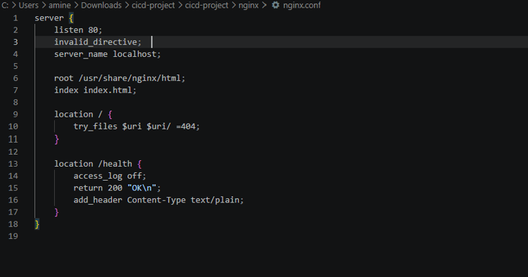
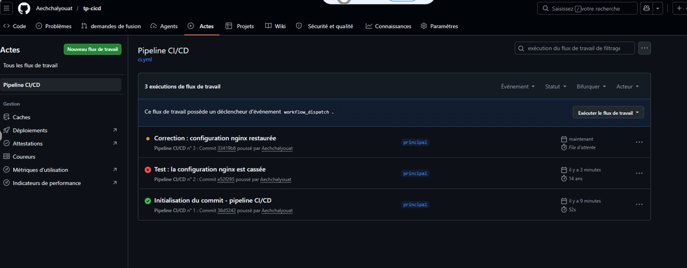
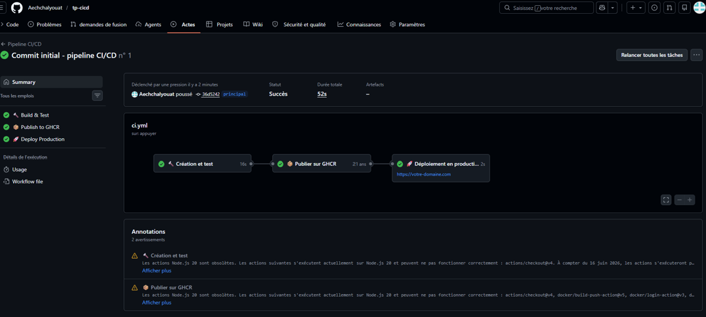
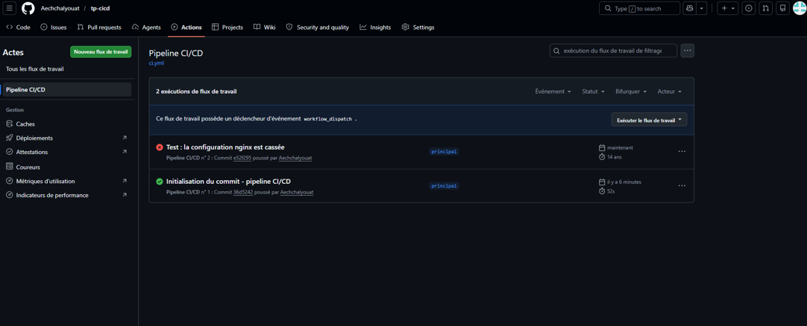

# 🚀 TP CI/CD — Nginx + GitHub Actions

**Amine Ech Chalyouat — EPSI Toulouse — Bachelor SYSOPS**

Pipeline CI/CD complet sur un projet Nginx containerisé — Niveaux 1, 2 et 3.

---

## 📁 Structure du projet

```
tp-cicd/
├── .github/workflows/ci.yml              → Le pipeline (le fichier le plus important)
├── Image/                                 → Captures d'écran du pipeline
├── nginx/nginx.conf                       → Config du serveur web
├── Dockerfile                             → Recette pour construire l'image
├── index.html                             → La page web
├── README.md                              → Documentation du projet
└── Documentation_CICD_Amine_Ech-chalyouat.pdf  → Dossier de rendu complet
```

---

## 🧠 C'est quoi le CI/CD ?

Avant le CI/CD, on déployait à la main via SSH — risqué, pas traçable, source d'erreurs.

Le CI/CD c'est un **robot automatique** qui se déclenche à chaque `git push` et exécute toutes les étapes à ta place :

```
git push → Build Docker → Tests → Publish image → Deploy prod
```

| Sigle | Signification | Rôle |
|-------|--------------|------|
| **CI** | Intégration Continue | Vérifie que le code est valide (build + tests) |
| **CD** | Déploiement Continu | Envoie le code validé vers la production |

---

## ⚙️ Le pipeline — 3 jobs

### Job 1 — Build & Test *(Niveaux 1 & 2)*

| Étape | Commande | Ce que ça fait |
|-------|----------|----------------|
| Checkout | `actions/checkout@v4` | Récupère le code sur le runner |
| Vérif fichiers | script bash | Vérifie que Dockerfile, index.html, nginx.conf existent |
| Build Docker | `docker build` | Construit l'image taguée avec le SHA du commit |
| Test config | `nginx -t` | Valide la syntaxe de nginx.conf — **c'est ici que ça plante si la config est cassée** |
| Test HTTP | `curl localhost:8080/` | Vérifie que le site répond HTTP 200 |
| Test /health | `curl localhost:8080/health` | Vérifie l'endpoint de santé |

> Le fichier `nginx.conf` avec `invalid_directive;` ajoutée volontairement :
> 
> 
> *Figure 1 — Config nginx.conf cassée → pipeline rouge déclenché*

---

### Job 2 — Publish to GHCR *(Niveau 3)*

S'exécute uniquement sur push vers `main`, après succès du Job 1.

- Publie l'image sur **GitHub Container Registry**
- Crée 2 tags : `sha-36d5242` (traçabilité) et `latest`
- Utilise `GITHUB_TOKEN` injecté automatiquement — **aucun secret dans le code**

---

### Job 3 — Deploy Production *(Niveau 3)*

- Nécessite une **approbation manuelle** via l'environment `production`
- Le pipeline s'arrête et attend le feu vert d'un reviewer

> Vue Actions avec le commit en file d'attente :
>
> 
> *Figure 2 — Commit en attente d'approbation manuelle avant déploiement prod*

---

## ✅ Résultats

> Pipeline vert — les 3 jobs passent en 52s :
>
> 
> *Figure 3 — Pipeline complet au vert : Build & Test → Publish GHCR → Deploy Production*

> Pipeline rouge — config nginx invalide :
>
> 
> *Figure 4 — Commit n°1 vert vs commit n°2 rouge (nginx.conf cassé)*

---

## 🔒 Sécurité

- ❌ Jamais de mot de passe ou token en clair dans le code
- ✅ `GITHUB_TOKEN` injecté automatiquement par GitHub, masqué dans les logs
- ✅ Permission `packages:write` uniquement sur le job qui en a besoin (moindre privilège)

---

## 📋 Niveaux validés

| Niveau | Ce qui a été fait |
|--------|------------------|
| ✅ **Niveau 1 — Novice** | Repo public, Dockerfile + nginx.conf + index.html, pipeline avec vérif fichiers et `nginx -t`, pipeline vert et rouge |
| ✅ **Niveau 2 — Engineer** | Trigger push/PR, tests HTTP `/` et `/health`, zéro secret dans les logs |
| ✅ **Niveau 3 — Architect** | Image publiée sur GHCR avec tag SHA, validation manuelle via environment `production` |

---

## 🗂️ Glossaire rapide

| Terme | Définition |
|-------|-----------|
| **Pipeline** | Suite d'étapes automatisées du code jusqu'à la prod |
| **Job** | Groupe d'étapes sur une même machine virtuelle |
| **Runner** | Machine virtuelle GitHub qui exécute le pipeline |
| **SHA** | Identifiant unique d'un commit (ex: `36d5242`) |
| **GHCR** | Entrepôt d'images Docker intégré à GitHub |
| **nginx -t** | Commande qui valide la syntaxe de nginx.conf |
| **HTTP 200** | Code de succès HTTP |
| **Moindre privilège** | N'accorder que les droits strictement nécessaires |
